<h1 align="center">Hi 👋, I'm Suraj Saini</h1>
<h3 align="center">A passionate Student intrested in Machine Learning and Data Analyst from India</h3>

- 🔭 I’m currently working on [Gold price Precdictor Modle](www.linkedin.com/in/surajsaini8810)# 🏠 House Price Predictor

[](https://python.org)
[](https://scikit-learn.org)
[](LICENSE)
[]()

> 🎯 **Smart AI-powered house price prediction system that estimates property values with just a few details!**

<div align="center">
  
</div>

## ✨ What Makes This Special?

🤖 **AI-Powered**: Uses machine learning to analyze housing patterns  
💬 **User-Friendly**: No technical knowledge required  
⚡ **Instant Results**: Get price estimates in seconds  
🎨 **Beautiful Interface**: Emoji-rich, easy-to-understand outputs  
🏆 **Accurate**: Trained on real housing market data  

## 🚀 Demo

```bash
🏠 HOUSE PRICE PREDICTION SYSTEM 🏠
🛏️  Number of bedrooms: 4
🚿 Number of bathrooms: 3
🏠 Living area: 2500 sq ft
🌊 Waterfront: Yes

🎯 Predicted House Price: $1,197,933.63
🏷️ Price Category: 💎 Luxury
```

## 🛠️ Quick Setup

```bash
# 1. Clone the repository
git clone https://github.com/suraj-saini8810/house-price-predictor.git
cd house-price-predictor

# 2. Install dependencies
pip install -r requirements.txt

# 3. Train the model
python train.py

# 4. Start predicting!
python predict.py
```

## 🧠 How It Works

```mermaid
graph LR
    A[📊 Housing Data] --> B[🤖 AI Training]
    B --> C[💾 Saved Model]
    C --> D[🏠 Your House Details]
    D --> E[💰 Price Prediction]
```

<div align="center">



</div>

1. **Data Analysis**: AI learns from thousands of house sales
2. **Pattern Recognition**: Identifies what makes houses valuable
3. **Smart Prediction**: Estimates your house price instantly

## 🎯 Input Features

| Feature | Description | Example |
|---------|-------------|---------|
| 🛏️ Bedrooms | Number of sleeping rooms | 3 |
| 🚿 Bathrooms | Number of bathrooms | 2 |
| 🏠 Living Area | Indoor space (sq ft) | 1500 |
| 📐 Lot Size | Total land area (sq ft) | 5000 |
| 🏢 Floors | Number of levels | 2 |
| 🌊 Waterfront | Water view (Yes/No) | No |
| ⬆️ Above Ground | Main floor area | 1200 |
| ⬇️ Basement | Underground area | 300 |
| 📅 Year Built | Construction year | 1995 |

## 💡 Feature Explanations

**🏠 Living Area vs 📐 Lot Size - What's the difference?**
- **Living Area**: The indoor space where you actually live (kitchen, bedrooms, living room)
- **Lot Size**: The entire piece of land your house sits on (house + yard + driveway)

Think of it like this: If your house is a book, living area is the pages, lot size is the entire shelf space!

## 🎨 Price Categories

| Category | Range | Icon |
|----------|-------|------|
| Affordable | < $300K | 💚 |
| Mid-Range | $300K - $600K | 💛 |
| High-End | $600K - $1M | 🧡 |
| Luxury | $1M+ | 💎 |

## 🔧 Technologies Used

<div align="center">


</div>

## 📁 Project Structure

```
house-price-predictor/
├── 🐍 train.py              # AI model training
├── 🎯 predict.py            # Price prediction tool
├── 📋 requirements.txt      # Python libraries
├── 📖 README.md             # You are here!
└── 💾 module.pickle         # Trained AI model (auto-generated)
```

## 🌟 What's Next?

- [ ] 📱 Web interface using Streamlit
- [ ] 📈 Add price trend predictions
- [ ] 🗺️ Include location-based factors
- [ ] 📊 Data visualization dashboard
- [ ] 🤖 More advanced AI algorithms

## 🤝 Contributing

Found a bug? Have an idea? Feel free to:
1. 🍴 Fork this repository
2. 🔧 Make your improvements
3. 📤 Submit a pull request

## 👨‍💻 About the Developer

<div align="center">

**Suraj Saini**  
🎓 BCA Student | 🤖 ML Enthusiast | 📊 Data Analytics Lover

[](https://linkedin.com/in/surajsaini8810)
[](mailto:0591suraj@gmail.com)
[](https://github.com/suraj-saini8810)

</div>

## 🏆 Other Cool Projects

🔗 Check out my other AI/ML projects:
- [🥇 Gold Price Predictor](https://github.com/suraj-saini8810/gold-price-prediction) - Predict gold market trends
- [📧 Spam Detection Model](https://github.com/suraj-saini8810/spam-detection) - Smart email filtering
- [🚨 Disaster Management System](https://github.com/suraj-saini8810/disaster-management) - Emergency response tool

---

<div align="center">

**⭐ Star this repo if you found it helpful! ⭐**

*"Making AI accessible, one prediction at a time"* 🚀

</div>

## 📜 License

This project is licensed under the MIT License - see the [LICENSE](LICENSE) file for details.

---
<div align="center">
  <sub>Built with ❤️ by Suraj Saini | © 2025</sub>
</div>

- 🌱 I’m currently learning **python , Macine Learning**

- 👨‍💻 All of my projects are available at [https://github.com/suraj-saini8810](https://github.com/suraj-saini8810)

- 📫 How to reach me **0591suraj@gmail.com**

- ⚡ Fun fact **I am always in learning mood**

<h3 align="left">Connect with me:</h3>
<p align="left">
<a href="https://linkedin.com/in/www.linkedin.com/in/surajsaini8810" target="blank"></a>
</p>

<h3 align="left">Languages and Tools:</h3>
<p align="left"> <a href="https://www.cprogramming.com/" target="_blank" rel="noreferrer">  </a> <a href="https://www.w3schools.com/cpp/" target="_blank" rel="noreferrer">  </a> <a href="https://www.figma.com/" target="_blank" rel="noreferrer">  </a> <a href="https://git-scm.com/" target="_blank" rel="noreferrer">  </a> <a href="https://www.w3.org/html/" target="_blank" rel="noreferrer">  </a> <a href="https://www.mysql.com/" target="_blank" rel="noreferrer">  </a> <a href="https://opencv.org/" target="_blank" rel="noreferrer">  </a> <a href="https://pandas.pydata.org/" target="_blank" rel="noreferrer">  </a> <a href="https://www.photoshop.com/en" target="_blank" rel="noreferrer">  </a> <a href="https://www.python.org" target="_blank" rel="noreferrer">  </a> <a href="https://scikit-learn.org/" target="_blank" rel="noreferrer">  </a> <a href="https://seaborn.pydata.org/" target="_blank" rel="noreferrer">  </a> </p>

<p></p>

🎓 BCA Student | 💻 Aspiring Software Developer | 📊 Interested in Data Science & Development  

## 🚀 About Me
- 🔭 I’m currently working on projects in **Python & C**
- 🌱 I’m learning **Machine Learning
- 👯 I’m looking to collaborate on **open-source projects & hackathons**
- 📫 Reach me at: [LinkedIn](https://linkedin.com/in/your-link) | [Email](mailto:youremail@gmail.com)

## 🛠️ Skills
- Languages: Python, C, HTML, C++
- Tools: Git, GitHub, VS Code  
- Interests: Data Analytics, Android Development, AI/ML  

## 📂 Featured Projects
- [Spam Detection Model](https://github.com/prithvi8810/spam-detection)  
- [Disaster Management in C](https://github.com/prithvi8810/disaster-management)  
- [Gold Price Prediction](https://github.com/prithvi8810/gold-price-prediction)  


